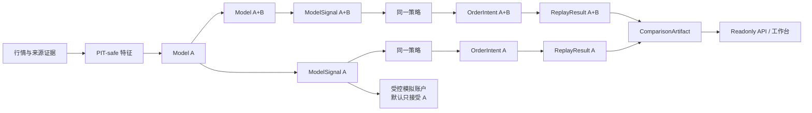

# Taiwan Stock Quant Platform

一个面向台股研究者的每日复盘工作台。它把候选排名、资料日期、模型与策略比较、历史回放、模拟账户和研究解释放在同一条可追溯链路中，帮助用户减少手工核对口径的时间。

这是只读研究产品，模拟账户也只用于 simulation。系统不连接真实券商，不自动下单，也不把模型分数包装成收益承诺。

## 你可以用它做什么

- 查看 Model A 当日 Top30/Top50 候选、行情日期、K 线和技术背景。
- 在同一已审计窗口比较 Model A 与 Model A+B 的收益、回撤、换手和费用。
- 回看策略意图、执行价格和费用如何形成历史模拟结果。
- 查看 simulation-only 模拟账户与每日运行状态。
- 让研究助手基于已验证的每日 artifact 解释候选；浏览核心结果不依赖 LLM。

## Model A 与 A+B

| 方案 | 当前角色 | 能做什么 | 不能做什么 |
| --- | --- | --- | --- |
| Model A：`e4_frozen_qlib_2018_2022` | 一等 model track；active baseline | 生成当前候选，进入默认策略与只读产品链路 | 不能绕过策略、回放和安全门禁直接变成订单 |
| Model A+B：`modelb_b19r2r_lambdarank_exact50_78f_v2` | 一等 model track；research candidate | 走与 A 相同的 ModelSignal、OrderIntent、ReplayResult 和比较接口 | 尚未获准成为默认模型或虚拟账户输入 |

默认策略是 `top50_exit_one_worst_sell`，回放采用 `next_open` 执行语义。当前 14 日共同完整窗口严格保留 Model A 原始 Top50；A+B 只排除缺少完整正交来源的 `TW7769`，不补入第 51 名，`TW6919` 正常参与重排。A+B 保持 `production_allowed=false`。系统只有一种通用 `ModelTrack` 执行模块；Model A 与 A+B 是它的两个配置实例，A+B 内部的 A 候选与 B 重排由 adapter 封装。所有 track 共用策略和回放接口，`configs/readonly_model_tracks.yaml` 单独管理 adapter、默认值和虚拟账户准入。每个 adapter 锁定 canonical model、模型族和候选边界；未知 adapter 或身份错绑都会在读取模型数据前失败，不能回退成 Model A。Paper decision 通过 `model_track_id` 选择轨道，服务端在写入模拟账户前校验 allowlist 及 track 与 canonical model 的绑定；当前 allowlist 只有 Model A。未来新增模型需要完成 registry、adapter、workflow 配置与准入审查，但不必复制模型编排、策略或回放模块。

## 系统如何工作



每一层只读取上游的标准 artifact。registry 决定模块可以服务哪些 consumer，validator 与 checksum 负责阻止缺字段、错日期或被篡改的结果继续向下游传播。

这张图描述目标接口和当前产品关系，不表示所有生产步骤都已迁移到统一 kernel。`tw_stock_workflow/` 已承载通用 resolver、DAG、观察 sidecar 和部分纯模块；现有日更、策略、回放与模拟账户正按合同增量迁移。当前实现状态见[模块地图与 artifact 流程](docs/tw_modular_contracts/TW_PROJECT_MODULE_MAP_AND_FLOW_CN.md)。

## 常用命令

```bash
make help
make start
make test
make verify
make demo
```

| 命令 | 用途 | 是否需要本机生产资产 |
| --- | --- | --- |
| `make start` | 在 `127.0.0.1` 启动现有后端和前端开发服务 | 需要 PostgreSQL、自己的 `.env`、市场数据与冻结模型 |
| `make test` | 自包含的快速检查：启动安全、PortfolioState facade 和前端主流程 | 不需要 live 数据或 ignored runtime artifact |
| `make verify` | 完整本机发布 gate：研究栈、ARCH-1、M1/M2/M3 合同和前端构建 | 需要冻结模型、active latest、运行证据及完整 ignored golden/runtime assets |
| `make demo` | fresh-checkout 的 healthy/fault fixture 桌面、平板、手机验收 | 不需要生产资产；需要先安装依赖和 Playwright Chromium |

这些入口只是包装仓库已有脚本，没有引入新的应用框架。

## 五分钟启动本机工作台

环境要求：Python 3.10+、PostgreSQL 14+、Node.js 20/22、corepack 和 pnpm。fresh checkout 不包含生产行情、数据库或冻结模型，完整页面需要先供应这些本机资产。

```bash
# 1. 后端依赖
cd backend
python -m venv .venv
source .venv/bin/activate
pip install -r requirements.txt
cd ..

# 2. 前端依赖
cd frontend
corepack pnpm install
cd ..

# 3. 从仓库根目录建立本机配置，再填写自己的 PostgreSQL、SECRET_KEY 和管理员凭证
cp .env.example backend/.env
# 编辑 backend/.env；不要使用或提交示例密钥

# 4. 启动
make start
```

浏览器打开：<http://127.0.0.1:8000/#/tw-stock-monitor>。按 `Ctrl+C` 会一起停止两个服务。`make start` 显式关闭订单、持仓同步、交易策略恢复和支付 worker，不会执行数据刷新、模型训练或 latest 发布。

## 没有生产资产也能演示

fixture 演示使用封存的测试数据，适合 fresh checkout 和面试前自检。它验证当前工作台在正常及依赖失败时的用户流程，不代表 live 数据新鲜度或真实模型评分。

```bash
cd frontend
corepack pnpm install
corepack pnpm exec playwright install chromium
cd ..

make demo
```

验收结果和真实截图写入 `tmp/product_fixture_acceptance/`，脚本结束后会关闭临时服务，不接触真实 latest 指针。

建议面试时依次展示：候选及日期 -> 单一标的与研究解释 -> A 与 A+B 同窗比较 -> simulation-only 账户与运维状态。详细讲解见[面试演示说明](docs/INTERVIEW_DEMO_CN.md)。

## 测试与发布检查

日常改动先运行：

```bash
make test
```

供应本机冻结资产后，发布前运行完整的本机 gate：

```bash
make verify
```

`make verify` 运行 CI 级研究栈、ARCH-1、M1/M2/M3 合同 gate 和前端生产构建。它不需要已启动的 live 服务，但需要本机已有冻结模型、active latest、运行证据以及完整的 ignored golden/runtime assets，因此不是 fresh-checkout 演示入口。它不会刷新 provider、切换 accepted latest、训练模型或提交订单。部署候选时，再按[稳定运维手册](docs/ops/STABLE_OPERATIONS_RUNBOOK_CN.md)在备用端口执行 live 只读验收。

## 安全边界

- 产品用于研究、解释和人工复核，所有候选与评分都不是投资建议。
- comparison workbench 始终 `no_apply=true`；页面选择不会修改 baseline、latest 或模拟账户。
- Model A 主链与 B19R2R shadow 分开判定。B19 `BLOCKED` 且 `mainline_blocking=false` 时，不应污染 Model A pending 状态。
- `GET /api/health` 只检查进程存活；`GET /api/ready` 还会只读检查数据库、registry、artifact 链和运行边界。
- 密钥、数据库 URL、真实市场数据和冻结模型不进入 Git。
- 数据刷新、provider publish、latest 切换、训练和任何订单路径都不在这些 Make 命令中。

## 仓库地图

| 路径 | 内容 |
| --- | --- |
| `backend/app/routes/` | Flask API 与台股路由 |
| `backend/app/services/` | 候选上下文、回放、Agent、模拟账户和运维状态 |
| `frontend/src/views/tw-stock-monitor/` | 台股研究工作台 |
| `tw_stock_workflow/` | 通用 workflow kernel、标准 adapter、观察 sidecar 和迁移中的纯模块 |
| `configs/` | active baseline、模块 registry、artifact 路径和回放政策 |
| `scripts/` | validator、日更编排、fixture 和验收脚本 |
| `tests/`、`backend/tests/` | 合同、服务与安全边界测试 |
| `docs/tw_modular_contracts/` | artifact 合同和扩展规范 |
| `docs/ops/` | 稳定运维、备份和恢复手册 |

## 继续阅读

- [项目原理与当前限制](docs/PROJECT_INTRO_CN.md)
- [技术架构、模块、数据结构与流向](docs/tw_modular_contracts/TW_PROJECT_MODULE_MAP_AND_FLOW_CN.md)（新开发者第一技术入口）
- [使用与环境配置](docs/USER_GUIDE_CN.md)
- [开发接手指南](docs/DEVELOPMENT_ONBOARDING_CN.md)
- [新模型与策略接入指南](docs/tw_modular_contracts/NEW_MODEL_AND_STRATEGY_DEVELOPER_GUIDE_CN.md)
- [稳定运维手册](docs/ops/STABLE_OPERATIONS_RUNBOOK_CN.md)
- [产品与运维审查](docs/PRODUCT_OPERATIONS_REVIEW_CN.md)
- [维护者接手指南](docs/CODEX_HANDOFF_CN.md)

项目基于 QuantDinger、QuantDinger-Vue、qlib 与 Scrapling 风格的数据采集流程扩展。发布或再分发时请保留上游许可和依赖许可。
