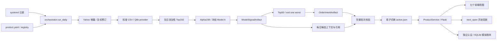

# Clean 后端架构与模块串联

这是模块化单体：一个 Python 包、一套 Flask API、一份产品配置。没有微服务消息队列或重复旧后端入口。前端使用 Vite 构建的原生 JavaScript，生产由同一个 Gunicorn / Flask 应用提供静态文件和 API。

## 两条执行路径

**日更写路径**：采集 → 标准化 → 候选筛选 → 排名 → 策略意图 → 问答上下文 → 校验 → 发布。每次运行独立保存。失败不覆盖当前批次，同日重跑也不会改坏上一份 Agent 引用。

**请求读路径**：浏览器 → Flask route → ProductService → 已发布 artifact / 本地行情。查询不抓取外部数据。历史回放可按请求计算，但不写当前排名或模拟账户。

## 源码导航

| 模块 | 入口 | 职责与边界 |
| --- | --- | --- |
| 配置与角色 | configs/product.yaml、config.py | 数据来源、baseline / shadow 角色、解析当前批次 |
| 数据 | provider_refresh.py、data.py | 增量抓取、复权修订回补、覆盖率、流式 provider；adapter 统一 normalize/store/query |
| 模型 | models.py | StageRegistry、冻结 E1、按日期 150 候选、有限分数和完整排名 |
| 策略 | strategy.py | Top50；每次退出一支最弱的落榜持仓 |
| 回放 | replay.py | 下一开盘、费用、现金与持仓、NAV 与回撤；缺价不静默跳过 |
| 发布 | orchestrator.py、artifacts.py | 独立目录、进程锁、校验后原子切换、manual / scheduled 分开记录 |
| 校验 | validation.py | 冻结身份、排名格式、文件来源与模型消费边界 |
| 研究 API | service.py、backend/app/routes/tw_stock.py | 排名、行情、比较、回放与状态；按所需标的读取行情 |
| 每日问答 | agent_builder.py、agent.py、agent_transport.py | 验证上下文后回答；当前为本地证据解释，远端适配默认关闭 |
| 模拟账户 | paper.py、backend/app/routes/paper.py | owner 认证、SQLite 事务、预览/确认、幂等与并发保护；不接收 B19R2R |
| 前端 | frontend/src/main.js、components.js、paper.js | 七页工作台；请求与渲染分离；系统页展示模块链路 |
| 运维 | maintenance.py、ops/clean-* | 日更、每10分钟健康检查、每日去重备份、日志与恢复 |
| 部署 | scripts/deploy_clean_product.py、install_clean_services.py | Git + 资产快照生成独立环境，验证后切换，启动失败恢复旧服务 |

未写全路径的 Python 文件均位于 `clean_product/`。

## 口径与稳定性

约 1,964 是本次有效行情覆盖数；它随更新变化。模型输入是当日筛出的 150 支，策略候选为 Top50。历史冻结档案保持原 candidate rank 与 full rank，不能把历史 84 条 post-filter 结果改成 150 条。

Qlib 分数表示相对研究排序；回放使用复权行情、冻结模型和指定策略。B19R2R 只重排同日 Top50，排除 TW7769 不补位；新日期缺经验证 78F 特征时，影子轨道不可用，Model A 主线不受影响。

- 每个 API 请求解析一次 active.json，固定本次读取的 provider、信号和 prompt。
- 发布只原子替换小型指针，保留旧批次用于恢复；日更进程锁防止并发。
- provider 按单股文件流式构建，Future 只保留摘要，避免全市场 DataFrame 驻留。
- 个股与候选背景只读取所需股票，排名优先读物化产物。
- health 表示进程存活；ready 检查基线信号与每日上下文来源。运维报告另行检查日更、备份和磁盘，ready不会掩盖这些失败。
- 持久SQLite账本在备份与部署时通过数据库backup接口一致性复制；代码版本和数据批次分别管理。
- 运行目录独立于源码checkout；升级不覆盖原目录，不删除旧代码或本机资产。

## 扩展

同供应商新增数据集：扩展 datasets 配置。新供应商：实现 SourceAdapter。新模型：注册 stage、配置阶段列表，默认 shadow 并独立准入。新 API：业务组合放 ProductService，route 只做请求校验和序列化。无需复制日更主线或另起框架。
