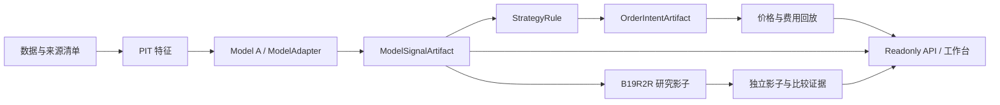

# 面试演示与工程说明

面试 PPT/讲稿智能体请先阅读 `docs/INTERVIEW_SHOWCASE_HANDOFF_CN.md`。本文件保留产品演示的背景说明；最新的真实前端验收、动态回放结果、截图路径和现场边界以交接归档为准。

## 产品定位

面向台股研究者的每日复盘工作台：把有日期与来源的候选、模型比较、历史模拟和模拟账户放在同一流程中。它减少手工核对数据口径的成本，不承诺收益，也不执行实盘订单。

## 建议演示顺序

1. 打开台股研究页面，说明模型日期、市场数据日期和候选排序；数据过期或缺失时展示状态，而不是把旧结果当今日结果。
2. 选择一个候选，查看排名、K 线和来源，再使用研究助手解释。助手消费验证后的每日 artifact，LLM 不是信号计算器，核心数据查看不依赖 LLM。
3. 在同一已审计历史窗口选择 Model A 和 Model A+B；比较收益、回撤、换手与费用。切换只改变展示，不能从比较页应用到 baseline 或账户。
4. 运行一次动态历史回放，展示任务状态、净收益、回撤、费用、动作数和 ReplayResult manifest；说明结果是隔离的只读任务，不是生产准入。
5. 解释 Model A 是 active baseline，B19R2R 只在 A Top50 内重排，使用 78 个 PIT-safe 特征。历史评估未满足联合门槛，因此保留为自动影子，体现评估和上线门禁的作用。
6. 查看模拟账户与运维状态。说明它们是 simulation-only；影子失败与主链失败分开显示，后续 daily no-op 不能隐藏最近 full 影子的状态。

## 架构说明



新增模型应输出同一信号合同；新增策略声明所需能力与字段；回放使用执行价和费用合同；前端通过 API 消费已验证的结果。训练、策略动作和回放结果不能混入相同模块。

## 可解释的工程取舍

- A+B 不一定更好：预测排序、策略收益、费用、集中度是不同指标。实验结果不达门槛时不切默认，避免按单项收益挑选模型。
- 历史回放加快开发，但不是收盘后真实生成的前瞻证据；两者分别标识。
- Artifact 验证保留日期、checksum 与来源，可以追溯失败与复现结果。
- 维护配置和非核心状态失败不应清空正常研究结果；后台交易任务默认关闭。
- 密钥必须持久配置，CLI 与 WSGI 使用同一启动校验，不能使用公开示例 JWT 密钥。

## 演示前检查

检查后端/前端服务、当日 artifact 日期、只读比较 API、Agent 是否启用以及最新审查报告。展示旧日期时明确说明是封存演示数据。不要运行真实日更、provider publish 或 demo fixture 生成器作为页面刷新动作。

第一次启动按 README 安装服务依赖、配置数据库和自己的密钥/管理员密码。市场数据与冻结模型不在 git 中；需要单独供应资产或在隔离环境使用 fixture。不要声称 fresh checkout 已能重现真实生产评分。

干净克隆可使用以下三步复现当前工作台的正常与故障 fixture 验收，不读取或改写真实 latest：

```bash
cd frontend && corepack pnpm install
corepack pnpm exec playwright install chromium
corepack pnpm test:product-fixture
```

## 应主动说明的限制

项目仍有渐进迁移中的大入口文件与 legacy route 委托，不能称为已充分解耦。单机备份与隔离恢复已经演练；当前证据仍不足以证明多机器高可用、B19 当前 v2 实现的自动 full-window 运行、自动收益结算闭环或所有继承交易模块的稳定性。实际审查结论与测试/截图见 `PRODUCT_OPERATIONS_REVIEW_CN.md`。
