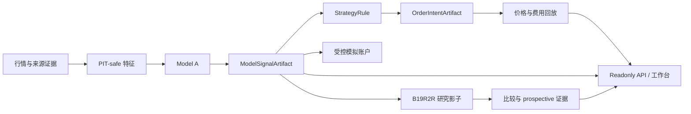

# Taiwan Stock Quant Platform 项目介绍

状态基准日期：2026-09-19。

## 1. 这是一个什么产品

这是一个面向台股研究者的每日复盘工作台。它把“数据是哪一天的、候选来自哪个模型、为什么值得研究、历史表现如何、模拟账户发生了什么”放进同一个可追溯流程。

用户不需要先理解 qlib、LightGBM 或 artifact 合同。打开台股研究页面后，可以依次完成：

1. 检查模型日期、行情日期和系统状态。
2. 浏览 Model A 的 Top30/Top50 候选与技术背景。
3. 查看单一标的的 K 线、趋势指标和研究解释。
4. 在相同、已审计的历史窗口比较 Model A 与 Model A+B。
5. 查看只读历史模拟和 simulation-only 模拟账户。

产品的核心价值不是“给出必涨股票”，而是减少研究者每天核对日期、来源、排名、策略口径和运行状态的成本，并让每个结论都能追溯到对应产物。

前端入口：`http://127.0.0.1:8000/#/tw-stock-monitor`。

## 2. 当前产品口径

| 角色 | 当前状态 | 用途 |
| --- | --- | --- |
| Model A：`e4_frozen_qlib_2018_2022` | 唯一 active baseline | 生成当前候选与默认研究链路 |
| B19R2R：`modelb_b19r2r_lambdarank_exact50_78f_v2` | 冻结的 research challenger | 在 Model A 同日 Top50 内重排，参与只读比较与自动影子 |
| 旧 Orthogonal LTR | legacy research artifact | 保留追溯和兼容路径，不是当前 challenger |
| `top50_exit_one_worst_sell` | 默认策略规则 | 以 `next_open` 口径执行只读回放或受控模拟流程 |

B19R2R 使用 LightGBM LambdaRank 和 78 个 PIT-safe 特征。TW7769 因正交数据不可用而被明确排除，并且不补位。它不能改变 Model A 的候选边界，也不能写入 provider/accepted latest、前端默认模型、模拟账户或订单链路。

历史只读回放中，A+B 在已审计窗口优于 A，但联合确认 gate 仍未全部通过。历史回放可以加快研究，不能替代按目标交易日生成的 prospective shadow 和后续收益结算。因此当前没有把 B19R2R 纳入 baseline。

## 3. 为什么比较页面“不可应用”

比较页面用于回答“同一窗口下，不同模型与策略的结果有什么差异”。它的所有下拉选择只改变展示，不修改默认模型、latest 指针或模拟账户，所以 API 明确返回 `no_apply=true`。

这不表示 Model A 在整个产品中都不能使用。Model A 已经是 active baseline；符合门禁的模拟账户动作由独立的 paper-portfolio 流程处理。比较页不承担配置发布或账户变更职责，这样可以避免用户在查看历史结果时意外改变当前运行状态。

## 4. 系统如何工作

每层只消费上游的标准产物：

- 数据层记录来源、日期、可得时间和覆盖范围。
- 特征层执行 PIT 检查，禁止未来信息进入模型。
- 模型层只输出分数与排名，不输出交易动作。
- 策略层把标准信号转成可审查的意图。
- 回放层应用固定执行价、费用和窗口规则。
- API 与前端只展示已经验证的 artifact。
- 模拟账户可以写 simulation-only 状态，但不连接真实券商。

模块合同、registry、validator 和 checksum 共同保证一项实验不能仅凭“历史收益较好”直接进入默认产品。

## 5. 日更与故障隔离

本机有两类日更任务：

- 两小时 daily lane 维护 Model A 主链状态。
- 工作日台北时间 22:45 的 full lane 补充正交来源并尝试 B19R2R 影子。

Model A 主链与 B19 影子分开判定。B19 `BLOCKED` 且 `mainline_blocking=false` 时，Model A 仍可保持 ready，主链 pending 也不应被污染。周末和台湾市场休市日保持上一个有效交易日是正常行为。

`GET /api/health` 只表示进程存活。`GET /api/ready` 还会只读检查 PostgreSQL、registry、Model A、策略快照、Agent prompt 和运行时安全边界。它不访问行情 provider，也不运行模型。

## 6. 安全边界

当前部署用于研究和人工复核：

- 不连接真实券商，不自动下单，不输出目标仓位。
- 后台订单、持仓监控、策略恢复和支付 worker 默认关闭。
- Agent 只读取验证后的每日上下文，不能调用交易工具。
- 评分、排名、历史收益不等于上涨概率、收益承诺或投资建议。
- 密钥、数据库 URL 和真实生产资产不进入 Git。

仓库保留部分上游 QuantDinger 交易相关模块，因为它们仍在 import/router 闭包内。当前研究部署通过启动门禁和 readiness 保证这些能力未启用；这也意味着不能把项目描述成已经彻底移除所有继承代码。

## 7. 当前成熟度与限制

Model A 研究产品已经完成本机只读部署验收、数据库与产物备份、隔离恢复演练、日志轮转、前后端回归和工作台 fixture 验收，适合进入稳定维护，也适合作为面试项目展示。

仍需如实说明的限制：

- 当前证据是单机部署，不代表多机高可用。
- B19R2R 当前精确实现仍需合法交易日的 scheduled full-lane 证据。
- B19 prospective outcome 自动结算与准入评估尚未闭环。
- 后端已建立合同边界并拆分部分 route，但仍有较大的继承服务与入口文件。
- fresh checkout 不包含生产行情、数据库和冻结模型，不能仅靠 Git 重现 live prediction。

## 8. 仓库地图

| 路径 | 内容 |
| --- | --- |
| `backend/app/routes/` | Flask API 与拆分后的台股 route |
| `backend/app/services/` | 台股上下文、回放、运维状态、Agent 和模拟账户服务 |
| `frontend/src/views/tw-stock-monitor/` | 台股研究工作台与子组件 |
| `scripts/` | 日更编排、artifact builder、validator、备份和验收工具 |
| `configs/` | baseline、模块 registry、产品 artifact 和回放策略 |
| `data_tw/`、`qlib_pipeline/data_tw/` | 本机忽略的 live artifact、模型与市场数据 |
| `docs/tw_modular_contracts/` | 模块合同、开发原则和详细 runbook |
| `docs/ops/` | 稳定运维、日常检查、备份与瘦身记录 |

## 9. 推荐入口

- 新 Codex/维护者：`docs/CODEX_HANDOFF_CN.md`
- 日常运维：`docs/ops/DAILY_OPERATIONS_CHECKLIST_CN.md`
- 开发接手：`docs/DEVELOPMENT_ONBOARDING_CN.md`
- 产品审查结论：`docs/PRODUCT_OPERATIONS_REVIEW_CN.md`
- 面试演示：`docs/INTERVIEW_DEMO_CN.md`
- 使用与安装：`docs/USER_GUIDE_CN.md`
