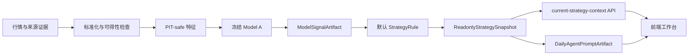
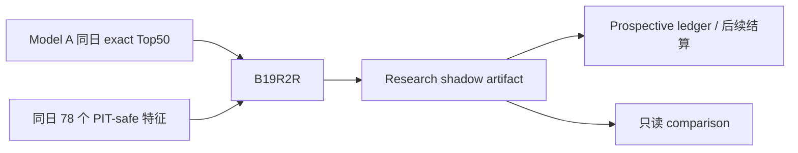
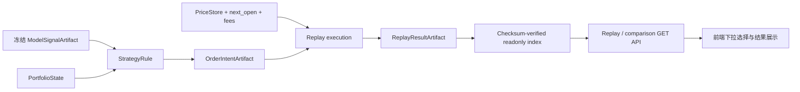
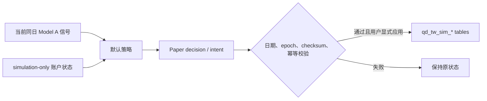

# 台股量化平台模块地图与数据流

状态基准日期：2026-09-20。

## 1. 先看懂三种状态

本文同时描述当前产品和后续架构，因此每个模块都标记成熟度：

| 标记 | 含义 | 可以怎样理解 |
| --- | --- | --- |
| `CURRENT` | 当前产品真实读取或运行的链路 | 线上行为以它为准 |
| `SHADOW` | 已自动接入或用于观察，但失败不会阻断 Model A | 可积累证据，不可替换 baseline |
| `CONTRACT` | 合同、模板或纯函数已具备，生产 runtime 尚未全面迁移 | 是扩展地基，不代表已经上线 |

判断当前事实时，依次查看：

1. `configs/active_baseline_descriptor.yaml`：唯一 active baseline 和默认策略。
2. `configs/tw_modular_registry.yaml`：模块能力、允许和禁止的 consumer。
3. `configs/tw_product_artifact_registry.yaml`：产品 artifact 路径。
4. `configs/tw_replay_window_policy.yaml`：允许展示的回放窗口和组合。
5. live artifact、validator 和 API：某个日期是否真的已产生并通过门禁。

旧 Phase YZ 路径、阶段报告和前端文案只能帮助追溯，不能覆盖上述真相源。

## 2. 当前产品口径

| 角色 | 当前身份 | 产品用途 |
| --- | --- | --- |
| Model A：`e4_frozen_qlib_2018_2022` | `CURRENT`，唯一 active baseline | 生成当前候选、默认策略输入和只读展示 |
| B19R2R：`modelb_b19r2r_lambdarank_exact50_78f_v2` | `SHADOW`，冻结 research challenger | 使用 78 个 PIT-safe 特征，在 Model A 同日 exact Top50 内重排 |
| 旧 Orthogonal LTR | legacy artifact | 只用于追溯和兼容，不是当前 Model B |
| `top50_exit_one_worst_sell` | `CURRENT`，唯一产品默认策略 | 按 `next_open` 语义生成只读回放或受控模拟意图 |

B19R2R 排除 TW7769 且不补位。它的历史回放净收益较高，但稳定性、弱市表现和收益集中度的联合门槛没有全部通过，因此保持 `production_allowed=false`、`no_apply=true`，不得进入 provider/accepted latest、前端默认模型、模拟账户或订单。

## 3. Artifact 的共同语言

Artifact 是一个可追溯、可校验的模块输出。不同合同的真实字段并不完全相同，但应能表达下面这些共同概念：

```json
{
  "artifact_type": "model_signal",
  "schema_version": "m1.0.0",
  "run_id": "stable-run-identity",
  "asof": "YYYY-MM-DD",
  "available_at": "ISO-8601 timestamp",
  "decision_cutoff": "ISO-8601 timestamp",
  "status": "READY",
  "source_artifacts": [
    { "manifest_path": "data_tw/artifacts/.../manifest.json" }
  ],
  "checksum_manifest": "checksum_manifest.json"
}
```

这段 JSON 是阅读用的共同外壳，不是可以直接替代各合同的万能 schema。实现时必须阅读对应合同，因为有些现有产物使用 `signal_asof`、`artifact_id`、单独 checksum evidence 或更严格的字段名。

这些字段分别回答：

| 字段概念 | 回答的问题 |
| --- | --- |
| `artifact_type`、`schema_version` | 这是什么数据，按哪一版合同解释 |
| `run_id` | 哪一次不可变运行产生了它 |
| `asof` / `signal_asof` | 数据或信号属于哪个交易日 |
| `available_at` | 它在现实中何时可被下游看见 |
| `decision_cutoff` | 本次决策最晚允许使用何时可得的数据 |
| `status` | 产物是否完整并可被合同允许的 consumer 使用 |
| `source_artifacts` | 它由哪些上游产物产生 |
| checksum evidence | 文件是否完整、内容是否被改变 |

最重要的时间规则是：

```text
source available_at <= decision_cutoff
```

最重要的当前页面日期规则是：

```text
current signal_asof
  == readonly snapshot signal_asof
  == Agent prompt signal_asof
```

旧 Phase YZ 或 paper decision 的日期不同，只能显示为历史状态，不能参与今日总览或当前模拟应用。

## 4. 模块输入输出总表

| 模块 / Artifact | 成熟度 | 输入 | 输出与关键身份 | 校验入口 | 消费方 | 明确禁止 |
| --- | --- | --- | --- | --- | --- | --- |
| DataSourceSnapshot / DataIngestion | `CURRENT` runtime；标准 M2 artifact 为 `CONTRACT` | provider 原始行情、交易日历、抓取时间 | 原始来源证据、标准化价格；`source_name/asof/available_at/run_id` | `scripts/validate_tw_modular_m_contracts.py`；日更各阶段 gate | Feature、PriceStore | 产生策略结论、直接改 baseline |
| FeatureArtifact | `CURRENT` 数据被 Model A/B 使用；统一 M2 外壳为 `CONTRACT` | 标准化行情、价格、可得时间 | PIT-safe 特征；`asof/available_at/feature_schema/source_artifacts` | 同上；B19 另有冻结 78 特征和 PIT 审计 | Model adapter、分析模块 | future return、label 泄漏；被策略或前端直接读取 |
| ModelSignalArtifact | Model A 为 `CURRENT`；B19 为 `SHADOW` | FeatureArtifact、冻结模型、底座候选边界 | `signals.csv`；`model_id/signal_asof/run_id/candidate_rank/buy_score/full_qlib_rank` | `MODEL_SIGNAL_CONTRACT_CN.md` 对应 validator、research stack | Strategy、readonly context、comparison | 输出交易动作；B19 改变 Model A exact Top50 边界 |
| PortfolioStateArtifact | `CONTRACT`，WF-5B 地基 | 已确认的历史模拟持仓、pending intent lineage | `portfolio_state.csv`、`pending_intents.csv`；`portfolio_id/asof/run_id` | `scripts/validate_tw_modular_m_contracts.py` | Strategy、Replay | 携带用户/账户/券商身份；由模型分数反推持仓 |
| StrategyRule / dependency | 当前默认规则为 `CURRENT`；通用纯内核为 `CONTRACT` | ModelSignalArtifact、PortfolioState、dependency YAML | 确定性的买卖意图规则；`strategy_id/version/required_capabilities` | dependency validator、WF-5A 纯函数测试 | OrderIntent builder | 读取模型私有 CSV、未来收益或回放结果 |
| OrderIntentArtifact | 现有只读/模拟链路为 `CURRENT`；统一 runtime 迁移中 | 标准信号、组合状态、策略规则 | `order_intents.csv`；`signal_date/instrument/intent_action/strategy_rule/signal_artifact` | `ORDER_INTENT_CONTRACT_CN.md` 对应 validator | Replay、受控 paper adapter | 真实下单、伪装为成交或目标持仓 |
| ReplayResultArtifact | 产品静态窗口为 `CURRENT`；WF-2 candidate 为 `CONTRACT` | OrderIntent、PriceStore、费用、`next_open` 执行配置 | 收益、回撤、换手、费用、每日轨迹；`model/strategy/window/run_id` | replay validator、D7 index/checksum gate | Readonly replay API、comparison | 按收益反改模型或策略；按请求临时重跑并写 runtime |
| ReadonlyStrategySnapshot | `CURRENT` | 已验证 Model A 信号、策略摘要、日期身份 | 当前候选与只读策略快照；`signal_asof/run_id/checksum` | snapshot validator、`GET /api/ready` | current context、Agent、前端 | 充当订单或 target position；失败时覆盖 previous latest |
| DailyAgentPromptArtifact | `CURRENT` | 同日 snapshot、候选、来源摘要 | 只读 Agent 上下文；`signal_asof/source checksums` | Agent prompt validator、readiness | simple-chat / Agent 面板 | 调用交易工具、给出收益承诺、使用异日信号 |
| Comparison API DTO | `CURRENT`，只读 | checksum 验证的静态 catalog、paired metrics、gate diagnostics | A 与 A+B 同窗结果；`selected/result/comparison/no_apply` | service 内 catalog、组合和 checksum 检查 | 前端模型比较区 | 动态训练、动态回放、切 baseline、写模拟账户 |
| Frontend Workbench ViewState | `CURRENT` | GET API DTO、当前 `signal_asof` | 页面筛选状态、候选、回放、比较、运维摘要 | fixture Playwright、network/console audit、build | 最终用户 | 直读 CSV、本地重算收益、用旧 Phase YZ 状态覆盖当前日期 |

各合同原文：

- [数据源](DATA_SOURCE_CONTRACT_CN.md)、[数据标准化](DATA_INGESTION_ARTIFACT_CONTRACT_CN.md)
- [特征](FEATURE_ARTIFACT_CONTRACT_CN.md)、[价格](PRICE_STORE_CONTRACT_CN.md)
- [模型信号](MODEL_SIGNAL_CONTRACT_CN.md)、[组合状态](PORTFOLIO_STATE_ARTIFACT_CONTRACT_CN.md)
- [策略规则](STRATEGY_RULE_CONTRACT_CN.md)、[订单意图](ORDER_INTENT_CONTRACT_CN.md)
- [回放结果](REPLAY_RESULT_CONTRACT_CN.md)、[前端只读展示](FRONTEND_READONLY_DISPLAY_CONTRACT_CN.md)
- [Agent 每日上下文](TW_AGENT_DAILY_PROMPT_ARTIFACT_CONTRACT_CN.md)

### 4.1 在仓库中去哪里找

| 想查看的部分 | 当前入口 |
| --- | --- |
| baseline、模型和产品 artifact 身份 | `configs/active_baseline_descriptor.yaml`、`configs/tw_modular_registry.yaml`、`configs/tw_product_artifact_registry.yaml` |
| 每日编排与状态 | `scripts/run_daily_tw_stock_auto_update.py`、`backend/app/services/tw_stock_readonly_ops_status.py` |
| 特征和历史数据索引 | `configs/feature_registry.yaml`、`data_tw/catalog/research_data_history/index.json`、产品 registry 的 `rebuild_sources` |
| 当前 Model A 上下文 | `backend/app/services/tw_stock_current_strategy_context.py` |
| 纯策略计算 | `tw_stock_strategy/top50_exit_one_worst_sell.py` |
| PortfolioState 校验 | `scripts/contracts/portfolio_state.py`、`scripts/validate_tw_modular_m_contracts.py` |
| OrderIntent 构建与校验 | `scripts/build_tw_modular_order_intent_artifact.py`、`scripts/validate_tw_modular_order_intent_artifact.py` |
| Replay 内核与产品读取 | `tw_stock_workflow/replay_execution.py`、`backend/app/services/readonly_replay_window.py` |
| Readonly snapshot | `tw_stock_workflow/readonly_snapshot.py`、`backend/app/services/readonly_strategy_snapshot.py` |
| Agent 每日上下文 | `backend/app/services/tw_stock_agent_daily_prompt.py` |
| A / A+B 比较 | `backend/app/services/readonly_model_strategy_comparison.py` |
| 模拟账户 | `backend/app/services/tw_stock_paper_portfolio.py`、`backend/app/routes/tw_stock_paper_routes.py` |
| 前端工作台 | `frontend/src/views/tw-stock-monitor/index.vue` 及其 `components/` |

## 5. 四条真实数据流

### 5.1 每日 Model A 主链



当前编排入口是 `scripts/run_daily_tw_stock_auto_update.py`。它负责调度、重试、状态记录和 publish gate。任何阶段失败时保留 previous latest，不能用半成品覆盖当前可用结果。

### 5.2 B19R2R 非阻断影子链



这条链是 `SHADOW`。B19 缺数据或失败时记录 `BLOCKED`，只要 `mainline_blocking=false`，Model A 主链继续运行。B19 不能补位 TW7769，不能写 Model A pending/latest，也不能成为 paper input。

### 5.3 历史回放与模型比较链



前端下拉框只选择已经审计的静态组合。`no_apply=true` 表示选择不会改变 baseline、latest 或模拟账户；它不表示 Model A 在整个产品里不可用。

### 5.4 模拟账户链



模拟账户是产品中单独的受控写路径，只写 `qd_tw_sim_*` 表，不连接真实券商。decision 或旧 Phase YZ `signal_asof` 与当前信号不同，前端和后端都必须阻止应用。

## 6. 前端与 API 的分工

普通用户侧栏只保留台股研究、台股模拟账户和个人中心。台股研究页主要读取：

```text
GET /api/tw-stock/current-strategy-context
GET /api/tw-stock/readonly-strategy-snapshot
GET /api/tw-stock/readonly-replay-window
GET /api/tw-stock/readonly/model-strategy-comparison
GET /api/tw-stock/quant/ops/daily-auto-update/status
GET /api/tw-stock/quant/ops/readonly-status
```

前端只负责选择和展示。指标、收益、策略动作、模型排名和日期一致性结论都由后端读取已验证 artifact 后返回，浏览器不直接读取实验 CSV，也不重算回放。

## 7. Workflow Kernel 现在做到哪里

`tw_stock_workflow/` 已提供 artifact resolver、模块注册、DAG、required/optional/nonblocking 依赖、幂等 run evidence 和若干纯模块。它用于逐步收敛历史脚本之间的连接方式。

当前必须如实区分：

| 阶段 | 已有能力 | 当前限制 |
| --- | --- | --- |
| WF-1 | readonly replay observation | 观察现有产物，不等于完整 ReplayResult 准入 |
| WF-2 | 隔离 replay candidate execution | 尚未替换产品全部回放 runtime |
| WF-3 | daily replay 只读 shadow | 默认关闭的非阻断 sidecar |
| WF-4A/4B | Model A 输入/信号与 snapshot shadow | 默认关闭的非阻断 sidecar，不改 publish |
| WF-5A | 纯策略计算内核 | 尚未接入 daily 或 replay runtime |
| WF-5B | PortfolioState 合同与模板 | 只有 owner-independent replay 地基，不是 per-user paper adapter |

因此，当前日更、策略、回放和模拟账户仍有 legacy service/script 负责真实运行。新增模块应优先接标准 artifact 和 kernel，但不得声称整个生产 runtime 已经迁移完成。详细迁移边界见[Workflow Kernel 迁移说明](TW_STOCK_WORKFLOW_KERNEL_MIGRATION_CN.md)。

## 8. 新功能应该怎样接入

```text
确认所属模块
  -> 阅读对应合同
  -> 在 registry 声明能力、依赖和禁止 consumer
  -> 生成不可变 artifact
  -> validator + 正反 golden sample
  -> 接入 workflow 或现有 adapter
  -> 只读 API
  -> 前端展示
```

新模型只需把输出适配为 ModelSignalArtifact；新策略只依赖标准信号、组合状态和 dependency YAML；新回放窗口只消费标准意图、价格和执行配置。这样日更、回放和前端可以复用同一模块，不需要为每个实验再写一套彼此不兼容的脚本。

## 9. 最低验证

纯文档修改执行链接、路径和命令检查以及 `git diff --check`。修改合同或实现时，至少运行对应 validator 和 focused tests；跨模块行为变化再运行：

```bash
PYTHONPATH=.:backend python scripts/run_tw_modular_contract_regression.py \
  --out-dir tmp/modular_contract_regression_onboarding --json

PYTHONPATH=.:backend python backend/scripts/verify_tw_stock_research_stack.py

cd frontend && corepack pnpm build
```

这些命令不会自动刷新 provider、切换 accepted latest、训练模型或提交订单。完整运维步骤见 `../ops/STABLE_OPERATIONS_RUNBOOK_CN.md`。
