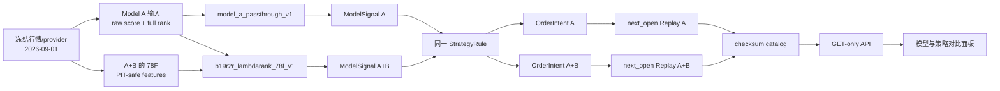
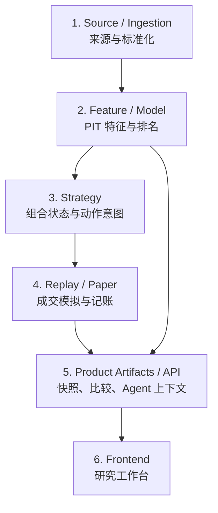
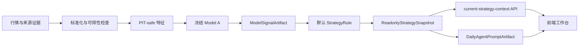
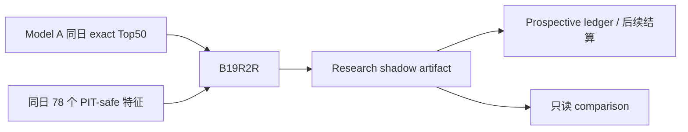
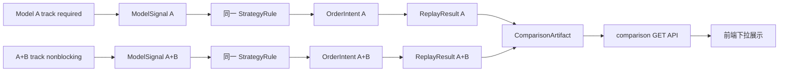
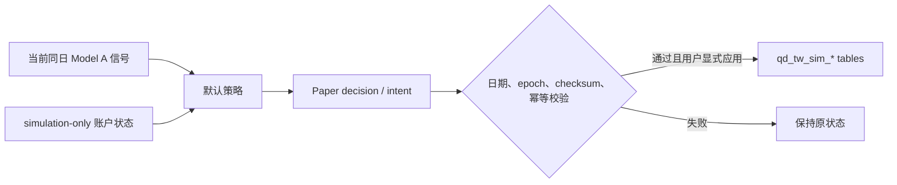

# 台股量化平台模块地图与数据流

状态基准日期：2026-09-20。

这是新开发者理解台股项目的第一份技术文档。读完本文，应能回答：产品解决什么问题、代码分成哪些模块、每层如何工作、输入输出长什么样、数据如何从 provider 到前端，以及修改一个模块时怎样避免破坏其他模块。

建议首次接手按以下顺序：

1. 先读本文第 1 至 3 节，再跟着第 3.1 节的真实交易日走完整条链。
2. 再看第 4 至 7 节，找到代码并理解模块实现与数据结构。
3. 用第 8 节理解日更、Model B、回放和模拟账户四条链。
4. 实际排错时直接使用第 11 节的追溯步骤。
5. 确定要修改的模块后，才进入对应的字段级合同。

业务介绍见[项目介绍](../PROJECT_INTRO_CN.md)，开发操作见[开发接手指南](../DEVELOPMENT_ONBOARDING_CN.md)，日常维护见[稳定运维手册](../ops/STABLE_OPERATIONS_RUNBOOK_CN.md)。本文负责技术全景，三者不重复定义当前 baseline。

## 1. 先看懂三种状态

本文同时描述当前产品和后续架构，因此每个模块都标记成熟度：

| 标记 | 含义 | 可以怎样理解 |
| --- | --- | --- |
| `CURRENT` | 当前产品真实读取或运行的链路 | 线上行为以它为准 |
| `SHADOW` | 已自动接入或用于观察，但失败不会阻断 Model A | 可积累证据，不可替换 baseline |
| `CONTRACT` | 合同、模板或纯函数已具备，生产 runtime 尚未全面迁移 | 是扩展地基，不代表已经上线 |

判断当前事实时，依次查看：

1. `configs/active_baseline_descriptor.yaml`：唯一 active baseline 和默认策略。
2. `configs/tw_modular_registry.yaml`：模块能力、允许和禁止的 consumer。
3. `configs/tw_product_artifact_registry.yaml`：产品 artifact 路径。
4. `configs/tw_replay_window_policy.yaml`：允许展示的回放窗口和组合。
5. live artifact、validator 和 API：某个日期是否真的已产生并通过门禁。

旧 Phase YZ 路径、阶段报告和前端文案只能帮助追溯，不能覆盖上述真相源。

## 2. 当前产品口径

| 角色 | 当前身份 | 产品用途 |
| --- | --- | --- |
| Model A：`e4_frozen_qlib_2018_2022` | `CURRENT`，唯一 active baseline | 生成当前候选、默认策略输入和只读展示 |
| Model A+B：`modelb_b19r2r_lambdarank_exact50_78f_v2` | `CURRENT` 历史只读 track；`SHADOW` 日更候选 | 与 A 共用标准信号、策略、意图、回放接口，治理状态为 research candidate |
| 旧 Orthogonal LTR | legacy artifact | 只用于追溯和兼容，不是当前 Model B |
| `top50_exit_one_worst_sell` | `CURRENT`，唯一产品默认策略 | 按 `next_open` 语义生成只读回放或受控模拟意图 |

Model A 与 A+B 在执行框架中都是 `model track`；`configs/readonly_model_tracks.yaml` 单独定义 workflow policy、默认 track 和虚拟账户允许列表。当前只有 A 是 active baseline 与虚拟账户允许项。Paper decision 使用 `model_track_id` 绑定所选轨道，checksum 和后端 apply gate 会共同校验该参数、allowlist 与 canonical model。当前 14 日完整窗口保留 Model A 原始 Top50；A+B 仅排除 `TW7769` 且不补位，`TW6919` 正常重排。新边界尚未完成准入评估，因此 A+B 保持 `production_allowed=false`、`no_apply=true`。

## 3. Artifact 的共同语言

Artifact 是一个可追溯、可校验的模块输出。不同合同的真实字段并不完全相同，但应能表达下面这些共同概念：

```json
{
  "artifact_type": "model_signal",
  "schema_version": "m1.0.0",
  "run_id": "stable-run-identity",
  "asof": "YYYY-MM-DD",
  "available_at": "ISO-8601 timestamp",
  "decision_cutoff": "ISO-8601 timestamp",
  "status": "READY",
  "source_artifacts": [
    { "manifest_path": "data_tw/artifacts/.../manifest.json" }
  ],
  "checksum_manifest": "checksum_manifest.json"
}
```

这段 JSON 是阅读用的共同外壳，不是可以直接替代各合同的万能 schema。实现时必须阅读对应合同，因为有些现有产物使用 `signal_asof`、`artifact_id`、单独 checksum evidence 或更严格的字段名。

这些字段分别回答：

| 字段概念 | 回答的问题 |
| --- | --- |
| `artifact_type`、`schema_version` | 这是什么数据，按哪一版合同解释 |
| `run_id` | 哪一次不可变运行产生了它 |
| `asof` / `signal_asof` | 数据或信号属于哪个交易日 |
| `available_at` | 它在现实中何时可被下游看见 |
| `decision_cutoff` | 本次决策最晚允许使用何时可得的数据 |
| `status` | 产物是否完整并可被合同允许的 consumer 使用 |
| `source_artifacts` | 它由哪些上游产物产生 |
| checksum evidence | 文件是否完整、内容是否被改变 |

最重要的时间规则是：

```text
source available_at <= decision_cutoff
```

最重要的当前页面日期规则是：

```text
current signal_asof
  == readonly snapshot signal_asof
  == Agent prompt signal_asof
```

旧 Phase YZ 或 paper decision 的日期不同，只能显示为历史状态，不能参与今日总览或当前模拟应用。

### 3.1 先跟一条真实数据走完：2026-09-01

这一节不先讲抽象名词，而是直接跟着仓库里已经生成的一组真实只读产物走一遍。示例信号日是 `2026-09-01`，按 `next_open` 规则在下一个交易日 `2026-09-02` 模拟执行。Model A 与 A+B 使用同一策略、同一执行规则和同一展示接口，因此可以看清模型排名不同怎样一路传到最终页面。

先明确证据边界：这是一条已经冻结的 **retrospective historical replay**，用于讲解和比较，不是 2026-09-01 当天 cron 留下的 untouched prospective 证据。输入来自冻结 provider、模型和特征物化，产物都声明 `readonly_only=true`、`production_allowed=false`；比较页面也声明 `no_apply=true`。因此下面的“成交”都是回放成交，不是真实订单。

#### 3.1.1 先看全链和四个控制文件



这次运行由四类配置共同约束，而不是由某个脚本自行决定全部行为：

| 控制点 | 文件 | 这次示例中的作用 |
| --- | --- | --- |
| 当前产品基线 | `configs/active_baseline_descriptor.yaml` | 确认默认仍是 Model A，策略是 `top50_exit_one_worst_sell`，执行价是 `next_open` |
| 模型轨道 | `configs/readonly_model_tracks.yaml` | 把 A 绑定到 `model_a_passthrough_v1`，把 A+B 绑定到 `b19r2r_lambdarank_78f_v1`；只允许 A 进入虚拟账户 allowlist |
| 工作流 DAG | `configs/workflows/readonly_dual_model_track_comparison.yaml` | A 是 required，A+B 是 nonblocking，最后汇合成 comparison catalog |
| 策略依赖 | `configs/strategy_dependencies/top50_exit_one_worst_sell.yaml` | 要求 `candidate_rank/buy_score/full_qlib_rank`，限制每日最多一买一卖，目标持仓 10 支 |

本次不可变输出根目录是：

```text
data_tw/artifacts/readonly_model_strategy_comparison/v9/
```

目录中的 `manifest.json` 负责说明身份和上游来源，CSV 放实际数据，`validation_report.json` 放校验结果，catalog 再用 SHA256 把三段产物绑定起来。

#### 3.1.2 第一步：来源数据变成模型可读输入

冻结输入的上游 provider 是：

```text
qlib_pipeline/data_tw/experiments/yahoo_adjusted_primary/option_c_150_qlib_bin
```

物化状态和来源 checksum 记录在：

```text
data_tw/experiments/project_runtime_convergence/
  modelb_b19r2r_pretraining_materialization_20260916/
  B19R2R_INPUT_MATERIALIZATION_STATE.json
```

Model A 读取 `MODEL_A_FULL_CROSS_SECTION.parquet`。其中两支股票在 `2026-09-01` 的真实输入是：

| date | instrument | model_a_raw_score | full_qlib_rank | signal_asof | available_at |
| --- | --- | ---: | ---: | --- | --- |
| 2026-09-01 | TW1326 | 0.122763 | 2 | 2026-09-01 | 2026-09-01 |
| 2026-09-01 | TW4971 | 0.050550 | 13 | 2026-09-01 | 2026-09-01 |

A+B 还读取 `FEATURE_ARTIFACT_78_RAW.parquet`。下面只截取 78 个特征中的少量字段：

| date | instrument | qlib_score_raw | qlib_rank | qlib_score_percentile_by_date | rank_change_1d | feature_raw_complete_78 |
| --- | --- | ---: | ---: | ---: | ---: | --- |
| 2026-09-01 | TW1326 | 0.122763 | 2 | 0.993333 | -70 | true |
| 2026-09-01 | TW4971 | 0.050550 | 13 | 0.920000 | -51 | true |

这一层的规范重点不是“必须有 78 个特征”，而是：

- `date + instrument` 唯一；
- `available_at <= signal_asof`，防止未来数据泄漏；
- 特征可以被模型消费，不能被策略或前端直接读取；
- future return、训练 label、真实成交和 PnL 不得进入推理特征。

数据从哪里来、删过哪些异常交易日、每个文件的 checksum 是什么，都能从 materialization state 和 `PIT_AUDIT.csv` 继续追溯。模型轨道的读取和 PIT 检查实现在 `tw_stock_workflow/dual_track.py::_load_frames` 与 `_adapt_b19r2r`。

#### 3.1.3 第二步：不同模型统一输出 ModelSignalArtifact

Model A 的 adapter 只是把冻结 qlib 输出映射到标准字段：

```text
candidate_rank <- full_qlib_rank
buy_score      <- model_a_raw_score
raw_score      <- model_a_raw_score
```

因此 `TW1326` 在 Model A 的真实标准信号是：

```json
{
  "date": "2026-09-01",
  "instrument": "TW1326",
  "model_name": "e4_frozen_qlib_2018_2022",
  "model_family": "qlib",
  "candidate_rank": 2,
  "buy_score": 0.12276265219402299,
  "score_rank": 2,
  "full_qlib_rank": 2,
  "signal_asof": "2026-09-01",
  "available_at": "2026-09-01"
}
```

真实文件：

```text
data_tw/artifacts/readonly_model_strategy_comparison/v9/artifacts/
  model_a_only/model_signal/signals.csv
```

A+B 的 adapter 先保留 Model A 原始 Top50 边界，再让冻结 LightGBM LambdaRank 使用 78F 重排 `buy_score`。例如 `TW4971` 的 qlib 边界排名仍是 13，但重排后买入排名变成第 3：

```json
{
  "date": "2026-09-01",
  "instrument": "TW4971",
  "model_name": "modelb_b19r2r_lambdarank_exact50_78f_v2",
  "model_family": "ltr",
  "candidate_rank": 13,
  "buy_score": 0.6064252446857941,
  "score_rank": 3,
  "full_qlib_rank": 13,
  "signal_asof": "2026-09-01",
  "available_at": "2026-09-01"
}
```

真实文件：

```text
data_tw/artifacts/readonly_model_strategy_comparison/v9/artifacts/
  model_a_plus_b_b19r2r/model_signal/signals.csv
```

对应代码是：

| 功能 | 代码入口 |
| --- | --- |
| Model A 标准映射 | `tw_stock_workflow/dual_track.py::_adapt_model_a` |
| A+B 的 78F 检查、加载模型和重排 | `tw_stock_workflow/dual_track.py::_adapt_b19r2r` |
| adapter 身份与 canonical model 绑定 | `tw_stock_workflow/dual_track.py::_resolve_track_adapter` |
| 写 ModelSignal 文件和 manifest | `tw_stock_workflow/dual_track.py::_materialize_signal_artifact` |

这一步体现了统一 ModelTrack 的意义：A+B 内部有两个模型，A 内部只有一个模型，但模块外部都只看到同一种 `ModelSignalArtifact`。合同见 `MODEL_SIGNAL_CONTRACT_CN.md`。策略从这里开始不再知道 LightGBM、qlib 参数文件或 78F 的存在。

#### 3.1.4 第三步：同一策略把排名变成意图

策略输入是“标准信号 + 当时的模拟组合状态 + 策略配置”。它不读取行情开盘价，也不决定成交数量。

Model A 在 `2026-09-01` 的关键判断是：当前持有的 `TW3006` 已跌到 `candidate_rank=84`，应卖出；未持有的 `TW1326` 排名靠前，应补入。输出是：

| signal_date | instrument | intent_action | candidate_rank | buy_rank | current_holding_flag | not_order |
| --- | --- | --- | ---: | ---: | --- | --- |
| 2026-09-01 | TW3006 | sell | 84 | -1 | true | true |
| 2026-09-01 | TW1326 | buy | 2 | 2 | false | true |

A+B 的组合当时尚未满 10 支，因此它不需要先卖出，直接选择重排后靠前且未持有的 `TW4971`：

| signal_date | instrument | intent_action | candidate_rank | buy_rank | current_holding_flag | not_order |
| --- | --- | --- | ---: | ---: | --- | --- |
| 2026-09-01 | TW4971 | buy | 13 | 3 | false | true |

真实输出分别位于：

```text
.../v9/artifacts/model_a_only/order_intent/order_intents.csv
.../v9/artifacts/model_a_plus_b_b19r2r/order_intent/order_intents.csv
```

规则实现是 `tw_stock_strategy/top50_exit_one_worst_sell.py::decide_for_model`，轨道编排和产物写入在 `tw_stock_workflow/dual_track.py::_materialize_decision_and_replay`。`not_order=true` 很关键：OrderIntent 只表示策略想做什么，禁止出现 `execution_price`、成交数量、现金、费用、净值或券商订单号。合同见 `ORDER_INTENT_CONTRACT_CN.md`。

#### 3.1.5 第四步：回放在下一交易日模拟执行

回放模块才允许读取执行价格。价格网格证明两支股票的下一交易日和开收盘价是：

| signal date | instrument | next trade date | next open | next close | execution grid complete |
| --- | --- | --- | ---: | ---: | --- |
| 2026-09-01 | TW1326 | 2026-09-02 | 74.5 | 72.800003 | true |
| 2026-09-01 | TW4971 | 2026-09-02 | 654.0 | 669.0 | true |

Model A 的意图在 `2026-09-02` 被模拟为两条 action：

| instrument | action | quantity | execution_price | fee_and_tax | cash_after | status |
| --- | --- | ---: | ---: | ---: | ---: | --- |
| TW3006 | sell | 370 | 276.0 | 451.8810 | 518467.7781 | EXECUTED |
| TW1326 | buy | 1380 | 74.5 | 146.50425 | 415511.2738 | EXECUTED |

A+B 的意图被模拟为：

| instrument | action | quantity | execution_price | fee_and_tax | cash_after | status |
| --- | --- | ---: | ---: | ---: | ---: | --- |
| TW4971 | buy | 150 | 654.0 | 139.7925 | 520024.2693 | EXECUTED |

现在才出现 `quantity`、`execution_price`、手续费、税费和 `cash_after`。这说明模块边界有效：策略没有提前偷看下一日价格，回放也没有反过来改变模型排名。

当日执行后的净值记录是：

| track | execution date | cash | market value | equity | daily return | drawdown |
| --- | --- | ---: | ---: | ---: | ---: | ---: |
| Model A | 2026-09-02 | 415511.27 | 581094.00 | 996605.28 | -0.6752% | -2.2938% |
| Model A+B | 2026-09-02 | 520024.27 | 542438.21 | 1062462.48 | 0.7501% | 0.0000% |

真实输出是各 track 的 `replay_result/actions.csv` 和 `daily_nav.csv`；执行代码仍由 `_materialize_decision_and_replay` 调用冻结且经过 parity 检查的回放语义。合同见 `REPLAY_RESULT_CONTRACT_CN.md`。

#### 3.1.6 第五步：从逐日结果汇总成可展示 catalog

前端展示的收益不是只看 9 月 1 日一天，而是读取同一 14 个交易日窗口的汇总。`catalogs/paired/comparison.csv` 中的真实结果是：

| track | final equity | net return | max drawdown | turnover | fee + tax |
| --- | ---: | ---: | ---: | ---: | ---: |
| Model A | 996605.28 | -0.3395% | -2.2938% | 1.4944 | 3499.72 |
| Model A+B | 1062462.48 | 6.2462% | -1.3392% | 1.7575 | 4427.48 |

`tw_stock_workflow/dual_track.py::build_comparison_bundle` 把每条轨道的三个标准 manifest 放进 catalog，并记录 SHA256：

```text
ModelSignalArtifact -> OrderIntentArtifact -> ReplayResultArtifact
```

catalog 同时记录：

- Model A 是 `active_baseline`、`workflow_policy=required`；
- A+B 是 `research_candidate`、`workflow_policy=nonblocking`；
- 当前虚拟账户 allowlist 只有 `model_a_only`；
- 两者在比较页都 `no_apply=true`。

因此“历史回放中 A+B 收益更高”和“A+B 已进入 baseline”是两件不同的事。前者是这份数据的结果，后者仍未获得准入。

#### 3.1.7 第六步：GET-only API 把 catalog 转成页面 DTO

页面选择 Model A、默认策略和这个窗口时，请求是：

```http
GET /api/tw-stock/readonly/model-strategy-comparison
  ?model_id=model_a_only
  &strategy_id=top50_exit_one_worst_sell
  &window_id=b19r2r_retrospective_complete_20260813_20260901
```

路由 `backend/app/routes/readonly_model_strategy_comparison.py` 只接受 GET。服务 `backend/app/services/readonly_model_strategy_comparison.py::load_readonly_model_strategy_comparison` 先验证 latest pointer、catalog 和各 source checksum，再返回适合页面使用的数据。真实响应的核心部分是：

```json
{
  "selected": {
    "model_id": "model_a_only",
    "strategy_id": "top50_exit_one_worst_sell",
    "window_id": "b19r2r_retrospective_complete_20260813_20260901"
  },
  "result": {
    "framework_role": "model_track",
    "governance_status": "active_baseline",
    "metrics": {
      "net_return": -0.003394721942222456,
      "max_drawdown": -0.02293822433302306,
      "fee_tax": 3499.721331871033
    },
    "no_apply": true,
    "runtime_effect": "none"
  },
  "status": {
    "selection_changes_display_only": true,
    "can_apply": false,
    "historical_artifact_validator": "PASS"
  }
}
```

前端调用入口是 `frontend/src/api/tw-stock-readonly.js::getTwStockReadonlyModelStrategyComparison`。`ReadonlyModelStrategyComparisonPanel.vue` 根据 catalog 动态生成模型、策略和窗口下拉框，再显示净收益、回撤、费用、换手和研究结论。切换下拉框只会再次 GET 已有 artifact，不会现场训练、回放、修改 baseline 或写入模拟账户。

#### 3.1.8 自己怎样只读复查这条链

下面四条命令分别查看信号、意图、模拟成交和最终比较；它们只读本地文件：

```bash
rg '^2026-09-01,TW1326,' \
  data_tw/artifacts/readonly_model_strategy_comparison/v9/artifacts/model_a_only/model_signal/signals.csv

rg ',2026-09-01,TW1326,' \
  data_tw/artifacts/readonly_model_strategy_comparison/v9/artifacts/model_a_only/order_intent/order_intents.csv

rg '^2026-09-01,2026-09-02,TW1326,' \
  data_tw/artifacts/readonly_model_strategy_comparison/v9/artifacts/model_a_only/replay_result/actions.csv

cat data_tw/artifacts/readonly_model_strategy_comparison/v9/catalogs/paired/comparison.csv
```

再运行聚焦 validator，确认两条轨道的 manifest、checksum、PIT、字段边界和禁止动作仍然通过：

```bash
PYTHONPATH=. python scripts/validate_tw_readonly_dual_model_tracks.py
```

如果本机没有 `data_tw/artifacts/.../v9`，表示只拿到了源码，没有供应本地运行证据；不能用手写 JSON 假装这条 artifact 链存在。此时仍可阅读上述嵌入示例和合同，但要运行完整比较必须先按运维手册供应受控数据资产。

## 4. 模块输入输出总表

系统可以看成六层。箭头表示标准数据依赖，不表示所有生产步骤都已迁入统一 workflow kernel：



分层的核心不是目录形式，而是职责：模型只排名，策略只决定意图，回放才计算成交与收益，API 只读取已校验产物，前端只展示。

| 模块 / Artifact | 成熟度 | 输入 | 输出与关键身份 | 校验入口 | 消费方 | 明确禁止 |
| --- | --- | --- | --- | --- | --- | --- |
| DataSourceSnapshot / DataIngestion | `CURRENT` runtime；标准 M2 artifact 为 `CONTRACT` | provider 原始行情、交易日历、抓取时间 | 原始来源证据、标准化价格；`source_name/asof/available_at/run_id` | `scripts/validate_tw_modular_m_contracts.py`；日更各阶段 gate | Feature、PriceStore | 产生策略结论、直接改 baseline |
| FeatureArtifact | `CURRENT` 数据被 Model A/B 使用；统一 M2 外壳为 `CONTRACT` | 标准化行情、价格、可得时间 | PIT-safe 特征；`asof/available_at/feature_schema/source_artifacts` | 同上；B19 另有冻结 78 特征和 PIT 审计 | Model adapter、分析模块 | future return、label 泄漏；被策略或前端直接读取 |
| ModelSignalArtifact | Model A 为 `CURRENT`；B19 为 `SHADOW` | FeatureArtifact、冻结模型、底座候选边界 | `signals.csv`；`model_id/signal_asof/run_id/candidate_rank/buy_score/full_qlib_rank` | `MODEL_SIGNAL_CONTRACT_CN.md` 对应 validator、research stack | Strategy、readonly context、comparison | 输出交易动作；B19 改变 Model A exact Top50 边界 |
| PortfolioStateArtifact | `CONTRACT`，WF-5B 地基 | 已确认的历史模拟持仓、pending intent lineage | `portfolio_state.csv`、`pending_intents.csv`；`portfolio_id/asof/run_id` | `scripts/validate_tw_modular_m_contracts.py` | Strategy、Replay | 携带用户/账户/券商身份；由模型分数反推持仓 |
| StrategyRule / dependency | 当前默认规则为 `CURRENT`；通用纯内核为 `CONTRACT` | ModelSignalArtifact、PortfolioState、dependency YAML | 确定性的买卖意图规则；`strategy_id/version/required_capabilities` | dependency validator、WF-5A 纯函数测试 | OrderIntent builder | 读取模型私有 CSV、未来收益或回放结果 |
| OrderIntentArtifact | 现有只读/模拟链路为 `CURRENT`；统一 runtime 迁移中 | 标准信号、组合状态、策略规则 | `order_intents.csv`；`signal_date/instrument/intent_action/strategy_rule/signal_artifact` | `ORDER_INTENT_CONTRACT_CN.md` 对应 validator | Replay、受控 paper adapter | 真实下单、伪装为成交或目标持仓 |
| ReplayResultArtifact | 产品静态窗口为 `CURRENT`；WF-2 candidate 为 `CONTRACT` | OrderIntent、PriceStore、费用、`next_open` 执行配置 | 收益、回撤、换手、费用、每日轨迹；`model/strategy/window/run_id` | replay validator、D7 index/checksum gate | Readonly replay API、comparison | 按收益反改模型或策略；按请求临时重跑并写 runtime |
| ReadonlyStrategySnapshot | `CURRENT` | 已验证 Model A 信号、策略摘要、日期身份 | 当前候选与只读策略快照；`signal_asof/run_id/checksum` | snapshot validator、`GET /api/ready` | current context、Agent、前端 | 充当订单或 target position；失败时覆盖 previous latest |
| DailyAgentPromptArtifact | `CURRENT` | 同日 snapshot、候选、来源摘要 | 只读 Agent 上下文；`signal_asof/source checksums` | Agent prompt validator、readiness | simple-chat / Agent 面板 | 调用交易工具、给出收益承诺、使用异日信号 |
| 通用 ModelTrack workflow | `CURRENT` 历史窗口 | track registry、已注册 adapter、冻结模型输入、执行价格 | 每个配置实例独立输出 ModelSignal、OrderIntent、ReplayResult；ComparisonArtifact | `scripts/validate_tw_readonly_dual_model_tracks.py`、adapter 身份校验、冻结 V3 replay core 独立 parity | Comparison API | 未知 adapter 回退到其他模型；写 provider/latest、修改 baseline、写模拟账户 |
| Comparison API DTO | `CURRENT`，只读 | checksum 验证的 v9 标准 track catalog；缺失时兼容 v8/v7/v6/v5/v1 catalog | 多 track 同窗结果、三段 lineage；`selected/result/comparison/no_apply` | service 内 catalog、组合、track manifest、parity 和 checksum 检查 | 前端模型比较区 | 动态训练、动态回放、切 baseline、写模拟账户 |
| Frontend Workbench ViewState | `CURRENT` | GET API DTO、当前 `signal_asof` | 页面筛选状态、候选、回放、比较、运维摘要 | fixture Playwright、network/console audit、build | 最终用户 | 直读 CSV、本地重算收益、用旧 Phase YZ 状态覆盖当前日期 |

各合同原文：

- [数据源](DATA_SOURCE_CONTRACT_CN.md)、[数据标准化](DATA_INGESTION_ARTIFACT_CONTRACT_CN.md)
- [特征](FEATURE_ARTIFACT_CONTRACT_CN.md)、[价格](PRICE_STORE_CONTRACT_CN.md)
- [模型信号](MODEL_SIGNAL_CONTRACT_CN.md)、[组合状态](PORTFOLIO_STATE_ARTIFACT_CONTRACT_CN.md)
- [策略规则](STRATEGY_RULE_CONTRACT_CN.md)、[订单意图](ORDER_INTENT_CONTRACT_CN.md)
- [回放结果](REPLAY_RESULT_CONTRACT_CN.md)、[前端只读展示](FRONTEND_READONLY_DISPLAY_CONTRACT_CN.md)
- [Agent 每日上下文](TW_AGENT_DAILY_PROMPT_ARTIFACT_CONTRACT_CN.md)

### 4.1 在仓库中去哪里找

| 想查看的部分 | 当前入口 |
| --- | --- |
| baseline、模型和产品 artifact 身份 | `configs/active_baseline_descriptor.yaml`、`configs/tw_modular_registry.yaml`、`configs/tw_product_artifact_registry.yaml` |
| 每日编排与状态 | `scripts/run_daily_tw_stock_auto_update.py`、`backend/app/services/tw_stock_readonly_ops_status.py` |
| 特征和历史数据索引 | `configs/feature_registry.yaml`、`data_tw/catalog/research_data_history/index.json`、产品 registry 的 `rebuild_sources` |
| 当前 Model A 上下文 | `backend/app/services/tw_stock_current_strategy_context.py` |
| 纯策略计算 | `tw_stock_strategy/top50_exit_one_worst_sell.py` |
| PortfolioState 校验 | `scripts/contracts/portfolio_state.py`、`scripts/validate_tw_modular_m_contracts.py` |
| OrderIntent 构建与校验 | `scripts/build_tw_modular_order_intent_artifact.py`、`scripts/validate_tw_modular_order_intent_artifact.py` |
| Replay 内核与产品读取 | `tw_stock_workflow/replay_execution.py`、`backend/app/services/readonly_replay_window.py` |
| Readonly snapshot | `tw_stock_workflow/readonly_snapshot.py`、`backend/app/services/readonly_strategy_snapshot.py` |
| Agent 每日上下文 | `backend/app/services/tw_stock_agent_daily_prompt.py` |
| A / A+B 标准历史双轨 | `configs/readonly_model_tracks.yaml`、`configs/workflows/readonly_dual_model_track_comparison.yaml`、`tw_stock_workflow/dual_track.py` |
| A / A+B 比较 API | `backend/app/services/readonly_model_strategy_comparison.py` |
| 模拟账户 | `backend/app/services/tw_stock_paper_portfolio.py`、`backend/app/routes/tw_stock_paper_routes.py` |
| 前端工作台 | `frontend/src/views/tw-stock-monitor/index.vue` 及其 `components/` |

## 5. 各模块具体怎样工作

### 5.1 数据来源、标准化与治理

日更编排器先确定目标交易日，再检查 provider 数据是否真的可得。抓取结果不会直接成为模型输入：原始来源、股票代码映射、覆盖率和字段类型先被记录，随后才标准化为价格或推理输入。

当前真实日更仍由 `scripts/run_daily_tw_stock_auto_update.py` 串联多个已有 service/script。标准 `DataSource` 和 `DataIngestionArtifact` 合同已经定义，但不能据此宣称所有 provider runtime 都已迁移成统一模块。

历史研究数据由 `data_tw/catalog/research_data_history/index.json` 按交易日索引。index 只保存 run 身份、manifest 路径和 checksum 引用，不复制另一份模型数据。这样回测、测试和后续训练可以找到同一份不可变输入，而不是依赖散乱的临时目录。

失败处理：数据尚不可得、覆盖不足或 checksum 不一致时，目标日期保持 pending，previous latest 不变。

### 5.2 特征、Model A 与 Model B

特征层用 `available_at` 和 `decision_cutoff` 证明某个值在决策时已经可见。FeatureArtifact 可以服务模型和研究分析，但策略与前端不能直接读取它。

Model A 使用冻结 qlib 模型产生受控推理截面的分数和排名，再由 adapter 写成标准 ModelSignalArtifact。核心字段分工固定：

- `candidate_rank`：候选边界，决定是否属于 Model A Top50。
- `buy_score`：候选池内的买入优先级。
- `full_qlib_rank`：持仓跌出 Top50 后比较谁最弱。

B19R2R 读取 Model A 原始 Top50 和同日 78 个 PIT-safe 特征，只重排 `buy_score`。当前完整窗口只有 `TW7769` 因正交来源不完整被排除且不补位；adapter 保留 Model A 的 `full_qlib_rank`，`TW6919` 正常重新评分。它输出研究 track，失败不阻断 Model A。

### 5.3 组合状态与策略

策略是确定性的纯规则：输入同一份 ModelSignal、PortfolioState 和 StrategyRuleConfig，必须得到同一组意图。当前默认规则 `top50_exit_one_worst_sell` 的配置是持有 10 支、候选边界 50、每日最多一买一卖；满仓且有持仓跌出 Top50 时，卖出 `full_qlib_rank` 最差的一支，再买入未持有候选中 `buy_score` 最高的一支。

纯计算实现位于 `tw_stock_strategy/top50_exit_one_worst_sell.py`。它不读取价格、现金、费用或数据库。PortfolioState 的标准合同已完成，但 canonical daily producer、pending order 交接和 per-user paper adapter 尚未全面迁入 kernel，所以当前真实 runtime 仍保留受控 legacy 连接。

### 5.4 OrderIntent、回放与比较

OrderIntent 表达“策略想做什么”，不表达“已经成交”。ReplayExecution 在下一交易日价格、手续费、税和现金约束下决定实际成交，再输出 actions、daily NAV、position snapshots 和 summary。

只读回放 API 不根据前端请求临时计算收益。历史 A/A+B 比较由 `readonly.dual_model_track_comparison` workflow 预先生成：A 与 A-only catalog 是 required 节点，A+B 和 paired comparison 是 nonblocking；各 track 独立演化组合状态，却使用同一策略规则、执行价格、费用和初始资金。每个 track 必须声明已注册的 `adapter_id`，adapter 同时锁定 canonical model、模型族、候选边界和自己的 source-bundle manifest；未知 adapter 或身份错绑都会在读取模型数据前失败，Model A 的输入引用也不依赖 B19 特征或训练产物。比较服务只读取已生成且 checksum 验证的 v9 catalog，并兼容回退 v8/v7/v6/v5/v1，所以切换下拉框不会训练、回放、写 provider/latest 或改变 baseline。

### 5.5 Snapshot、Agent 与 API

ReadonlyStrategySnapshot 把通过校验的当前候选压成稳定的产品输入。DailyAgentPromptArtifact 再从同日 snapshot 生成 Agent 可解释的上下文。`GET /api/ready` 会核对 Model A、snapshot 和 Agent prompt 的日期与 checksum。

后端 service 负责读取文件、验证 identity、整理 DTO；route 只处理 HTTP 参数和统一响应。前端 API 封装位于 `frontend/src/api/tw-stock-readonly.js`，页面组件不能跨过后端直接读取 `data_tw/`。

### 5.6 前端与模拟账户

台股研究页以 `current-strategy-context` 为当前日期和候选的主来源，再分别加载 snapshot、回放、比较、运维和 Agent 数据。某个辅助接口失败时，已有 Model A 核心内容不应被清空。

模拟账户是独立的 simulation-only 写路径。用户显式应用前，后端校验 decision、`signal_asof`、账户 epoch、input checksum 和 idempotency key，只写 `qd_tw_sim_*` 表。它不复用比较页选择，也不连接 broker。

## 6. 关键数据结构实例

以下示例帮助阅读代码，字段约束仍以链接的合同为准。示例中的日期和 run ID 会随日更变化。

### 6.1 latest pointer：找到当前不可变运行

`latest.json` 很小，只负责指向已经通过门禁的 run：

```json
{
  "artifact_type": "controlled_model_signal_latest_pointer",
  "model_id": "e4_frozen_qlib_2018_2022",
  "run_id": "dng9_daily_auto_model_signal_gate_...",
  "signal_asof": "2026-09-18",
  "canonical_manifest": "data_tw/artifacts/signals/.../manifest.json",
  "canonical_manifest_sha256": "...",
  "readonly_only": true,
  "production_trade_enabled": false
}
```

pointer 可以在发布成功后前移；它指向的 run 目录不可原地修改。读取方先校验 pointer，再校验 manifest 和文件 checksum。

### 6.2 FeatureArtifact：长表特征

```csv
feature_date,instrument,feature_name,feature_value,source_data_artifact,lookback_window,signal_asof,available_at,pit_policy
2026-09-18,TW2330,ret_20d,0.0312,data_tw/artifacts/data_ingestion/...,20,2026-09-18,2026-09-18T17:00:00+08:00,available_at_lte_cutoff
```

标准合同用一行表示一支股票在一个日期的一个特征。当前 B19 的受管研究输入仍可能是 legacy 宽表，由 adapter 映射进入模型链；它冻结使用 78 个特征，schema 和顺序由模型产物及 validator 固定，不能由调用方临时增删。合同格式存在不等于 legacy runtime 已完成物理迁移。

### 6.3 ModelSignalArtifact：模型与策略的接口

```csv
date,instrument,model_name,model_family,candidate_rank,buy_score,raw_score,score_rank,full_qlib_rank,signal_asof,available_at,source_artifact,source_model_artifact,source_feature_artifact
2026-09-18,TW3264,e4_frozen_qlib_2018_2022,qlib,1,0.075526,0.075526,1,1,2026-09-18,2026-09-18,...,...,...
```

策略只认这些标准列，不认 qlib、LightGBM 或历史实验的私有列。Model B 也必须输出同样接口，并保持 Model A 的候选边界字段。

### 6.4 PortfolioState 与 StrategyRuleConfig

```csv
asof_date,instrument,quantity,cost_basis,current_holding_flag
2026-09-18,TW2330,1000,945.5,true
```

```yaml
strategy_rule: top50_exit_one_worst_sell
target_holding_count: 10
candidate_k: 50
max_buy_count: 1
max_sell_count: 1
sell_boundary: candidate_rank_gt_candidate_k
buy_order: buy_score_desc_instrument_asc
```

标准 PortfolioState 不包含用户、券商或账户身份；per-user paper 状态必须通过单独 adapter 投影后才能进入通用策略接口。

### 6.5 OrderIntentArtifact：策略决定

```csv
signal_date,instrument,intent_action,intent_reason,strategy_rule,candidate_rank,buy_rank,full_qlib_rank,max_buy_count,max_sell_count,model_name,signal_artifact
2026-09-18,TW2330,buy,buy_score_top_candidate,top50_exit_one_worst_sell,8,1,8,1,1,e4_frozen_qlib_2018_2022,data_tw/artifacts/signals/.../manifest.json
```

这里没有数量、成交价、手续费、现金或收益，因为这些属于执行与回放层。

### 6.6 ReplayResultArtifact：执行结果

一个 replay run 至少包含：

```text
manifest.json
summary.csv
actions.csv
daily_nav.csv
position_snapshots.csv
coverage_audit.csv
execution_audit.csv
forbidden_action_audit.json
```

`summary.csv` 记录 window、model、strategy、initial cash、fee/tax、final equity、total return、max drawdown 和 action counts；`actions.csv` 才包含 `execution_date`、`quantity`、`execution_price` 和费用。

### 6.7 API DTO：前端只消费这一层

本文列出的主要台股产品 API 使用统一 HTTP 外壳：

```json
{
  "code": 1,
  "msg": "success",
  "data": {
    "ok": true,
    "schema_version": "...",
    "readonly_only": true
  }
}
```

例如 comparison 的 `data` 还包含 `catalog`、`selected`、`result`、`comparison.delta`，并固定声明：

```json
{
  "no_apply": true,
  "runtime_effect": "none",
  "status": {
    "selection_changes_display_only": true,
    "baseline_admission_allowed": false
  }
}
```

## 7. 文件、索引和数据库怎样分工

| 存储形式 | 保存什么 | 更新方式 |
| --- | --- | --- |
| 不可变 run 目录 | manifest、CSV/JSON、audit、validator、checksum | 创建新 run，不原地覆盖 |
| `latest.json` pointer | 当前已准入 run 的身份和路径 | 所有 gate 通过后原子前移；失败保留旧值 |
| research history index | 每个交易日的 Model A/B 输入与输出引用 | 日更追加或重建索引，不复制源 artifact |
| PostgreSQL `qd_tw_sim_*` | 用户 simulation-only 账户、持仓和 apply audit | 经过登录、epoch、checksum、幂等校验后写入 |
| API DTO | 面向前端的当前视图 | 每次请求从受控 artifact/数据库只读组装 |

Git 不保存 live 行情、冻结模型和本机数据库。Git 保存合同、registry、代码、golden samples 和测试；备份系统保存恢复当前产品所需的 ignored runtime assets。

三个经常混淆的日期：

| 日期 | 含义 |
| --- | --- |
| `asof` / `signal_asof` | 行情、特征或模型判断所属的交易日 |
| `available_at` | 数据在现实中可以被系统看到的时间 |
| `target_date` / execution date | 策略展示目标或实际使用 next-open 的成交日 |

三个经常混淆的 latest：provider/qlib accepted latest、controlled Model A signal latest、readonly snapshot/Agent latest。它们职责不同，任何模块都不能因为自己成功就越权修改其他 pointer。

合同中的 JSON 或 golden sample 是结构示例，不是当前运行配置。当前模型和策略身份必须从 baseline descriptor、modular registry、live manifest 和 readiness 共同确认。

## 8. 四条真实数据流

### 8.1 每日 Model A 主链



当前编排入口是 `scripts/run_daily_tw_stock_auto_update.py`。它负责调度、重试、状态记录和 publish gate。任何阶段失败时保留 previous latest，不能用半成品覆盖当前可用结果。

### 8.2 B19R2R 日更非阻断影子链



这条链是日更 `SHADOW`。B19 缺数据或失败时记录 `BLOCKED`，只要 `mainline_blocking=false`，Model A 主链继续运行。它与下一节已经标准化的历史双轨不同；canonical daily PortfolioState 和 paper adapter 尚未迁移，因此不能把历史链完成误写成日更或虚拟账户已经完成。

### 8.3 历史回放与模型比较链



各 track 使用相同合同和计算模块，并分别生成完整 lineage。A+B 失败不会使 A 节点失败；此时 A-only catalog 仍可发布，paired comparison 只有在两轨都通过时才生成。Model A 新结果已与冻结、独立的 V3 replay core 对动作、NAV 和汇总指标逐项 parity；Model B 分数与冻结模型重算结果一致。前端按 catalog 动态展示已审计的静态组合；`no_apply=true` 表示选择不会改变 baseline、latest 或模拟账户。

### 8.4 模拟账户链



模拟账户是产品中单独的受控写路径，只写 `qd_tw_sim_*` 表，不连接真实券商。decision 或旧 Phase YZ `signal_asof` 与当前信号不同，前端和后端都必须阻止应用。

## 9. 前端与 API 的分工

普通用户侧栏只保留台股研究、台股模拟账户和个人中心。台股研究页主要读取：

```text
GET /api/tw-stock/current-strategy-context
GET /api/tw-stock/readonly-strategy-snapshot
GET /api/tw-stock/readonly-replay-window
GET /api/tw-stock/readonly/model-strategy-comparison
GET /api/tw-stock/quant/ops/daily-auto-update/status
GET /api/tw-stock/quant/ops/readonly-status
```

前端只负责选择和展示。指标、收益、策略动作、模型排名和日期一致性结论都由后端读取已验证 artifact 后返回，浏览器不直接读取实验 CSV，也不重算回放。

## 10. Workflow Kernel 现在做到哪里

`tw_stock_workflow/` 已提供 artifact resolver、模块注册、DAG、required/optional/nonblocking 依赖、幂等 run evidence 和若干纯模块。它用于逐步收敛历史脚本之间的连接方式。

当前必须如实区分：

| 阶段 | 已有能力 | 当前限制 |
| --- | --- | --- |
| WF-1 | readonly replay observation | 观察现有产物，不等于完整 ReplayResult 准入 |
| WF-2 | 隔离 replay candidate execution | 尚未替换产品全部回放 runtime |
| WF-3 | daily replay 只读 shadow | 默认关闭的非阻断 sidecar |
| WF-4A/4B | Model A 输入/信号与 snapshot shadow | 默认关闭的非阻断 sidecar，不改 publish |
| WF-5A | 纯策略计算内核 | 尚未接入 daily 或 replay runtime |
| WF-5B | PortfolioState 合同与模板 | 只有 owner-independent replay 地基，不是 per-user paper adapter |

因此，当前日更、策略、回放和模拟账户仍有 legacy service/script 负责真实运行。新增模块应优先接标准 artifact 和 kernel，但不得声称整个生产 runtime 已经迁移完成。详细迁移边界见[Workflow Kernel 迁移说明](TW_STOCK_WORKFLOW_KERNEL_MIGRATION_CN.md)。

## 11. 怎样追溯页面上的一条数据

假设前端某支股票的排名或日期看起来不对，按同一方向向上游追溯，不要从实验目录猜测：

```text
页面组件
  -> frontend/src/api/tw-stock-readonly.js
  -> Flask route
  -> backend service
  -> product registry / latest pointer
  -> immutable run manifest
  -> CSV/JSON + validator report + checksum
  -> research history 中的上游来源
```

第一步，读取页面使用的主 API：

```bash
curl -fsS http://127.0.0.1:5000/api/tw-stock/current-strategy-context \
  | jq '.data | {context,source_manifests,consistency_audit}'
```

第二步，从 `source_manifests.model_a` 找到真实 manifest，核对 `model_id`、`run_id`、`signal_asof`、`status` 和 signals 文件，不要先打开旧 Phase YZ 目录。

第三步，核对三个当前 pointer 是否同日：

```bash
jq '{model_id,run_id,signal_asof,canonical_manifest}' \
  data_tw/artifacts/signals/e4_frozen_qlib_2018_2022/latest.json

jq '{signal_asof,snapshot_manifest}' \
  data_tw/artifacts/publish/readonly_strategy_snapshot/latest.json

jq '{signal_asof,manifest}' \
  data_tw/artifacts/agent_daily_prompt/latest.json
```

第四步，在 `data_tw/catalog/research_data_history/index.json` 找同一日期，继续查看 inference input、source acquisition run、文件 SHA256 和 validator report。若 index 与 live pointer 不一致，先判断是索引未更新还是产品发布失败，不能手改日期让它们表面一致。

比较页异常时，从 comparison API 返回的 `sources.catalog` 和选中 `combination_id` 追到静态 catalog 与 paired metrics。模拟账户异常时，从 latest decision 的 `decision_id`、`input_checksum`、`paper_account_epoch` 追到 apply audit；两条链都不应反向修改 Model A artifact。

## 12. 新功能应该怎样接入

```text
确认所属模块
  -> 阅读对应合同
  -> 在 registry 声明能力、依赖和禁止 consumer
  -> 生成不可变 artifact
  -> validator + 正反 golden sample
  -> 接入 workflow 或现有 adapter
  -> 只读 API
  -> 前端展示
```

新模型只需把输出适配为 ModelSignalArtifact；新策略只依赖标准信号、组合状态和 dependency YAML；新回放窗口只消费标准意图、价格和执行配置。这样日更、回放和前端可以复用同一模块，不需要为每个实验再写一套彼此不兼容的脚本。

## 13. 最低验证

纯文档修改执行链接、路径和命令检查以及 `git diff --check`。修改合同或实现时，至少运行对应 validator 和 focused tests；跨模块行为变化再运行：

```bash
PYTHONPATH=.:backend python scripts/run_tw_modular_contract_regression.py \
  --out-dir tmp/modular_contract_regression_onboarding --json

PYTHONPATH=.:backend python backend/scripts/verify_tw_stock_research_stack.py

cd frontend && corepack pnpm build
```

这些命令不会自动刷新 provider、切换 accepted latest、训练模型或提交订单。完整运维步骤见 `../ops/STABLE_OPERATIONS_RUNBOOK_CN.md`。
